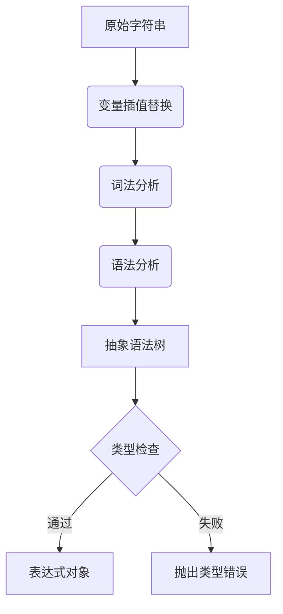

# ExprBuild DSL 语法规范

## 基本结构
DSL 表达式由以下元素构成：
```ebnf
expression = variable | number | binary-op | function-call;
binary-op   = expression operator expression;
operator    = '+' | '-' | '*' | '/' | '^';
function-call = ident '(' expression (',' expression)* ')';
```

## 核心特性
1. **变量插值**：使用 `${变量名}` 语法引用 explicit 表达式
   ```javascript
   const a = expl`a = 3`;
   const expr1 = expr`${a} + 5`; // 等价于 a + 5
   ```

2. **运算符优先级**（从高到低）：
   - 括号 `()`
   - 指数 `^`
   - 乘除 `* /`
   - 加减 `+ -`

3. **自动类型转换**：
   ```javascript
   expr`2x`    // 自动转换为 2*x
   expr`x²`    // 自动转换为 x^2
   expr`|x|`   // 转换为 abs(x)
   ```

4. **与 Desmos 的差异**：
   | 特性         | ExprBuild DSL      | Desmos          |
   |--------------|--------------------|-----------------|
   | 乘法运算符   | 显式 * 或隐式连接 | 隐式连接        |
   | 函数参数分隔 | 逗号               | 逗号或隐式分隔 |
   | 特殊符号     | 有限Unicode支持    | 全LaTeX支持     |
## 高级特性
1. **条件表达式**：
   ```javascript
   expr`x > 0 ? ${a} : ${b}`
   // 编译为: \begin{cases} a & x>0 \\ b & \text{otherwise} \end{cases}
   ```

2. **链式比较**：
   ```javascript
   expr`0 < x < 10` → (0 < x) && (x < 10)
   ```

3. **向量表示**：
   ```javascript
   expr`[x, y, z]`        // 坐标点
   expr`v ⋅ w`            // 向量点积 → dot(v, w)
   expr`‖v‖`              // 向量模长 → norm(v)
   ```

4. **类型系统集成**：
   ```typescript
   // 自动推断依赖关系
   const a = expl`a = 3`;
   const b = expl`b = 4`;
   const c = expr`${a}^2 + ${b}^2`;  // 类型自动推断为依赖a,b的表达式
   ```

5. **错误处理**：
   ```javascript
   expr`x + `  // 抛出 DSLSyntaxError: Unexpected end of input
   expr`${未定义变量}` // 抛出 ReferenceError: 变量未声明
   ```

## 解析流程
